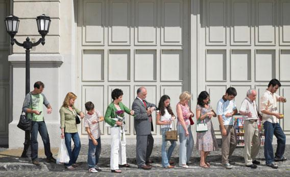

# Don't Wait, Just Eat!

This repository contains code for an interactive React web app bootstrapped with Create React App. 

## Authors: Yiren Qu, Xifei Wang, Jarett Lund-Hopkins, Seth Anderson

### The site can be viewed at <https://foodie-map-b331b.firebaseapp.com> or <https://info340b-wi19.github.io/Dont-Wait-Just-Eat/>

        
### App Description

This web app helps hungry users find a place to eat within a desired waiting time. Users first log in with their Google account. They then input their location (automatic geolocation, or manual entry), and are prompted with nearby restaurants and their respective wait times. After selecting an option, they are brought to a page where they can read about the restaurant's hours, type of cuisine, and rating. They can then book a reservation for themselves or a party and then check the reservation they booked, cancelling it if needed.

### App functionality Walkthrough
1. Log in via the "Log in / register" button in the navagition bar.
2. Select a waiting time from the options under "How long can you wait?"
3. Click "Locate Me" or enter a location in the text field and click "Start Search"
4. Click a restaurant marker on the map, or click one under the "Waittime" list
5. Click "View more info" on the restaurant's info window
6. Enter reservation information at the bottom of the page, and click "Reserve Now"
7. Check on their reservation by clicking "My Reservations" in the navigation bar, cancelling their resrvation as needed

### Sources and references
[Google Map API Search for nearest restaurant.]("https://developers.google.com/places/web-service/search#PlaceSearchRequests)
[Yelp API]("https://www.yelp.com/developers/documentation/v3/get_started")

